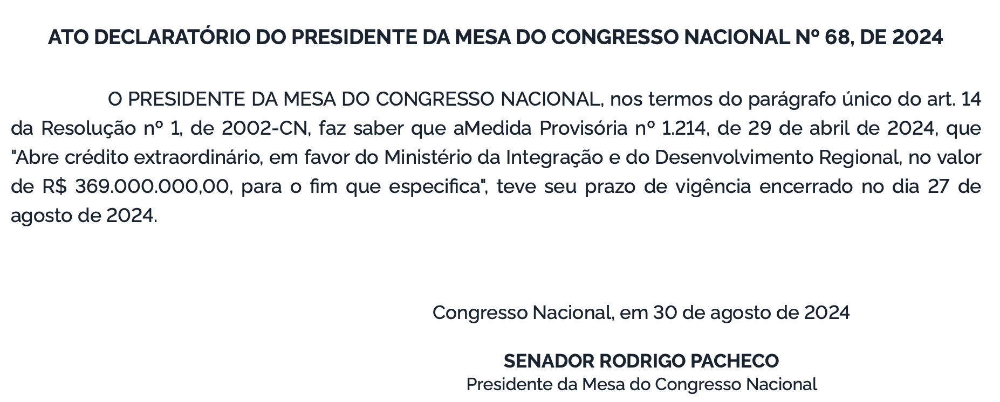
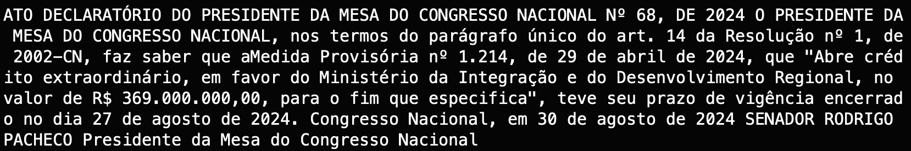

# Extrator de publicações do Diário Oficial da União 

## 💻 Descrição do Projeto
Este projeto, resultado da colaboração entre o Instituto de Computação (IComp) da Universidade Federal do Amazonas (UFAM) e a empresa JusBrasil, tem como objetivo o desenvolvimento de um extrator de publicações do Diário Oficial da União.

Utilizando a biblioteca [Selenium](https://www.selenium.dev/), o projeto constrói um script automatizado que, a partir de um link correspondente a uma seção específica do DOU em uma data determinada, acessa as publicações e realiza a extração do conteúdo textual.

🏁 Tabela de conteúdos
=================
<!--ts-->
   * 🔘 [Capturas de tela](#-capturas-de-tela)
   * 🔘 [Como usar](#-como-usar)
   * 🔘 [Experimentos e Resultados](#-experimentos-e-resultados)
<!--te-->

## 📸 Capturas de Tela

Publicação: 
<p align="center">
  
</p>

Texto extraído:
<p align="center">
  
</p>

## 📖 Como usar

Para poder utilizar a aplicação, você vai precisar ter instalado a biblioteca [Selenium](https://www.selenium.dev/).

```bash
# Clone este repositório
$ https://github.com/gioandrade7/ner_extension.git
```

1. No script `pub_extraction.py` altere a variável `url` para a url da seção do DOU da qual deseja extrair as publicações.
2. Execute o script `python pub_extraction.py`.

## 🔬 Avaliação e Resultados

A avaliação desse método se deu através do cálculo das métricas de precisão, revocação e f1-score. 

As publicações extraídas foram comparadas com as da tabela fornecida, abrangendo as três seções do Diário Oficial da União do dia 02/09/2024.

Os resultados obtidos foram:

- **Precisão:** 0.95
- **Revocação:** 0.77
- **F1-score:** 0.85

Os falsos positivos podem ser justificados por pequenas variações nos caracteres entre as publicações extraídas e as da tabela. Por exemplo:

*Nº 12.275 ≠ N° 12.275*

Os falsos negativos podem ser justificados pelos seguintes motivos:

- Alguns coincidem com casos de falsos positivos;
- Publicações extensas são divididas em várias partes e tratadas como entradas separadas na tabela. No entanto, o algoritmo extrai a publicação completa, não considerando essas divisões como falsos negativos, uma vez que não têm uma correspondência exata na tabela.

Análises mais aprofundadas são necessárias para identificar outras possíveis justificativas.

## 📈 Melhorias

- O algorimto extrai o texto somente de tags <p> no html. Ou seja, informações contidas em outras *tags* (como de tabelas) não são extraídas;  
- O texto bruto da página é recuperado, dependendo do objetivo podem ser necessárias formatações adicionais.


 


